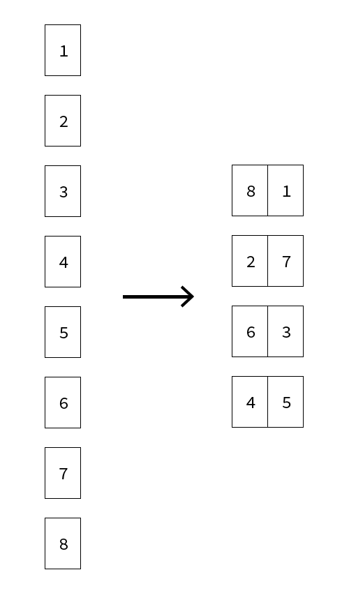

Python Print Booklet
============

Python Print Booklet is Python2 script able to impose a single page pdf into ready-to-print booklet.

## Improvements in queue
* Adjustable spread size
* Print marks
  * color bars
  * grey bars
  * crop marks
  * fold marks
  * registration marks
  * comments
  * signature and spread number

## Getting ready

* Install pip `$ easy_install pip`
* Install PyPDF2 `$ pip install PyPDF2`
* Explore the samples folder

## Step by step

* Launch `print_booklet.py` in Terminal:
`$ python print_booklet.py input_path.pdf`

* Answer questions:
  * Verbose: `True` or `False`
  * Signatures number: a positive integer (ex: `4`)
  * Signature pages number: `regular` or `irregular`
  * If the previous answer was `irregular`, you have to insert your signature pages sequence (separated by comma) like `4, 8, 16, 8, 16, 8, 4`

* Enjoy your IMPOSED pdf

